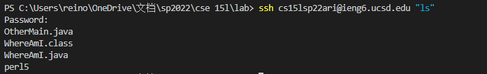

# lab-report-1-week- 2

## lab1 example
### Lei Chen (Reno)

*Hello, this is Reno, and I am about to show you how to o log into a course-specific account on ieng6.*

## Installing VScode

1. installing [Visual Studio Code](https://code.visualstudio.com/)
    


## Remotely Connecting

1. [install OpenSSH](https://docs.microsoft.com/en-us/windows-server/administration/openssh/openssh_install_firstuse)

2. look up your course-specific account for CSE15L [here](https://sdacs.ucsd.edu/~icc/index.php)

3. in VScode command line insert:
`$ ssh cs15lsp22zz@ieng6.ucsd.edu` (replace zz with your own one)

4. type *yes*, type your password.


## Trying Some Commands
    
1. try running some commands like `cd`, `ls`, `pwd`, `mkdir`.


## Moving Files with scp
    
1. Create a file on your computer called WhereAmI.java and put the following contents into it
    
```
class WhereAmI {
public static void main(String[] args) {
System.out.println(System.getProperty("os.name"));
System.out.println(System.getProperty("user.name"));
System.out.println(System.getProperty("user.home"));
System.out.println(System.getProperty("user.dir"));
    }
}
```

2. Try to run it using `javac` and `java` on your computer

3. In command put: `scp WhereAmI.java cs15lsp22zz@ieng6.ucsd.edu:~/` (zz shoud be your own one)

4. log into ieng6 with ssh again, and use `ls`

5. Run it on the ieng6 computer using `javac `and `java`.


## Setting an SSH Key

1. on your computer put: `$ ssh-keygen`

2. Enter file in which to save the key
`(/Users/<user-name>/.ssh/id_rsa): /Users/<user-name>/.ssh/id_rsa` **(replace user-name to your own)**

3. Enter passphrase step (empty for no passphrase)
    
4. Enter same passphrase again(empty either)
    
5. log into ieng6 with ssh again, put `$ mkdir .ssh`, then **logout**
    
6. on your computer put:`$ scp /Users/<user-name>/.ssh/id_rsa.pub
cs15lsp22zz@ieng6.ucsd.edu:~/.ssh/authorized_keys`
    
7. Now you should be able to ssh or scp from this client to the server without
entering your password


## Optimizing Remote Running

1. creat a new file with sothing in it

2. In command put: `$ scp WhereAmI.java cs15lsp22zz@ieng6.ucsd.edu:~/` (zz shoud be your own one)
    
3. log into SSH without password and check, it already there!

4. What's more, We can use the pattern: `$ ssh cs15lsp22zz@ieng6.ucsd.edu "<commands>"`, and it only takes one step to implement command in server from client. Really reduce time!



## Work cite
[lab1](https://canvas.ucsd.edu/courses/37650/files/6790252?module_item_id=1346316)
