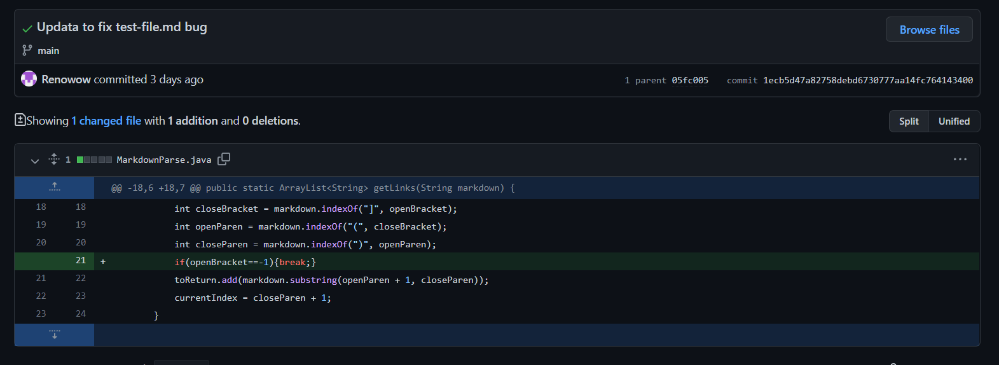
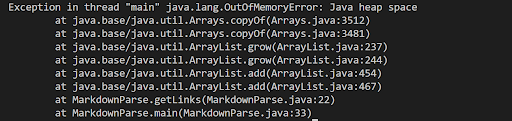
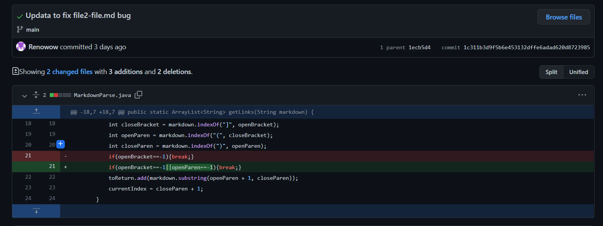
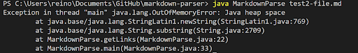
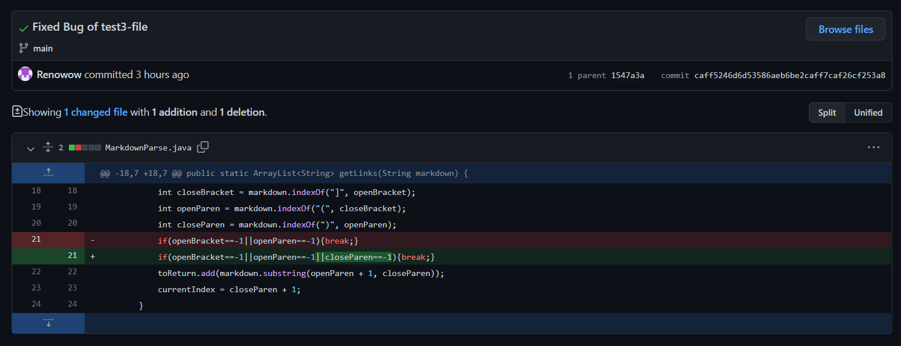
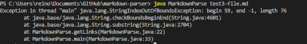

# Lab-report-2-Week-4

## Code Change to fix Bug in program

>*Hello! This is Reno, this time I am going to show some bug fixing*

>*Also we are going to look into the symptom, and figure out why would it happen and how to fix it!*

### Code Change 1
* Screenshot of the code change
    
    

* Link to the test file with failure input

    [test-file.md](https://renowow.github.io/markdown-parser/test-file.md)

* Show the symptom (error output)
    
    

* The relationship between the bug, the symptom, and the failure-inducing input

    The main bug we have here is that we have a while loop here but we don’t have a break to get out of the while loop. For the symptom, it is because in the *test-file.md* we have a new line or a space in the last line, and our program cannot find the starting index (openBracket), then it keeps running the while loop so that eventually OutOfMemory. So we need break the while loop when open Bracket is -1.

### Code Change 2
* Screenshot of the code change
    
    

* Link to the test file with failure input

    [test2-file.md](https://renowow.github.io/markdown-parser/test2-file.md)

* Show the symptom (error output)
    
    

* The relationship between the bug, the symptom, and the failure-inducing input

    The problem here is that the last line only has a `[link3]` without any links attached in the *test2-file.md*, so the program keeps searching for open paren. In the end, it will show the Out Of Memory symptom. In order to fix this bug, we should add a break when the program can not find an open paren.

### Code Change 3
* Screenshot of the code change
    
    

* Link to the test file with failure input

    [test3-file.md](https://renowow.github.io/markdown-parser/test3-file.md)

* Show the symptom (error output)
    
    

* The relationship between the bug, the symptom, and the failure-inducing input

    The bug we have here is caused by losing a close paren at the end of the last link in *test3-file.md*, and our program started open paren but can not find the index of this close paren so it returns -1. Then, it will show the symptom like index out of bounds, because subString will not receive a negative number. We can fix this citation by adding the condition– break when close paren equal to -1.
