# Lab-Reprot-3-Week-6

>This is Reno, in this lab report I am going to show you basicaly three parts
>Streamline `ssh` Configuration;  Set up Github Access from ieng6; Copy Whole Directories with `scp`
>`-r`


## Streamline `ssh` Configuration

---

* ### Show your `.ssh/config` file, and how you edited it (with VScode, another program, etc)

    *I use the Notepad to edit it, and my  `.ssh/config` file show below*

    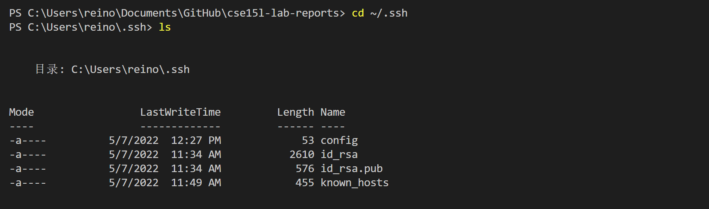
* ### Show the `ssh` command logging you into your account using just the alias you chose

    *I use `notepad config` in command to check the `ssh` command in my `.ssh/config` file*
    *`ieng 6` is the name of the I can use to call this file*

    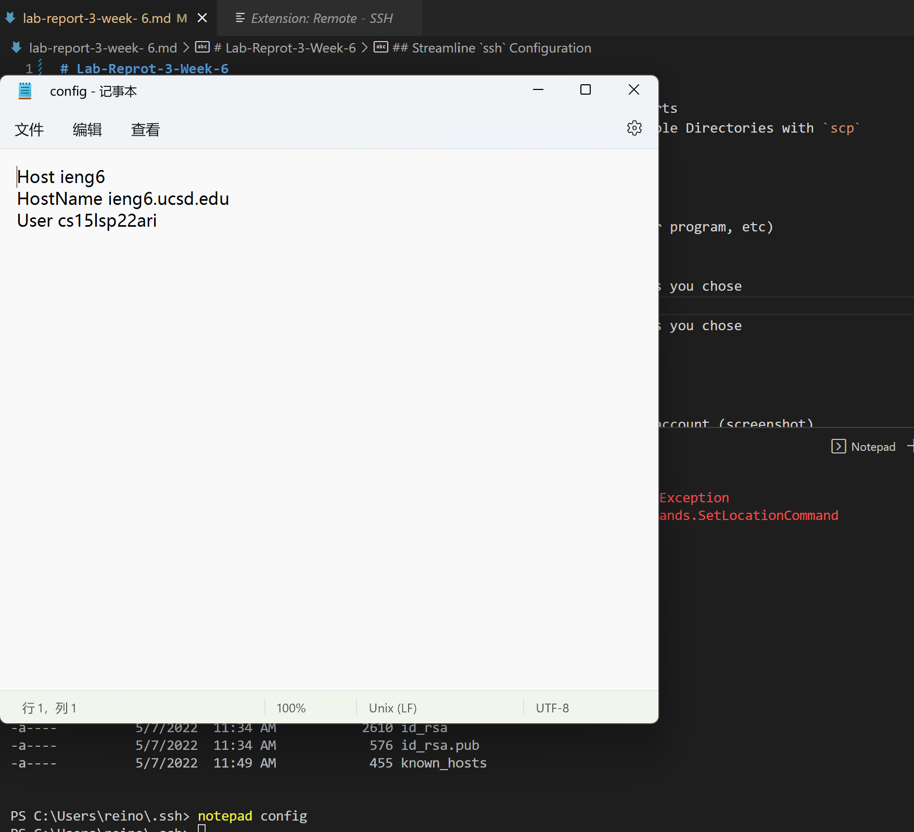

    *Now, I can logging into server with command `ssh ieng6`*

    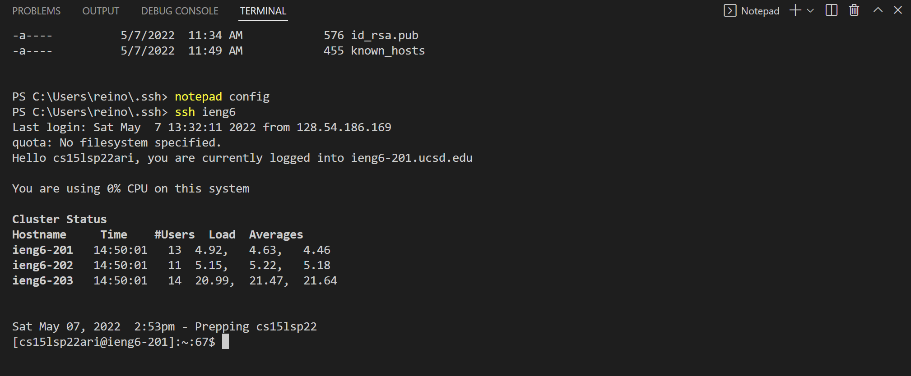
* ### Show an `scp` command copying a file to your account using just the alias you chose

    *I use the `scp` <file/directory> `ieng6:.` to copy a file in my computer into ieng6.*
    *And I can also put a file name after `ieng6:` which allows me put the file into a*
    *specific position(directory) in `ieng6`.*

    *After copy we can use `ls` in server to check whether success or not*

    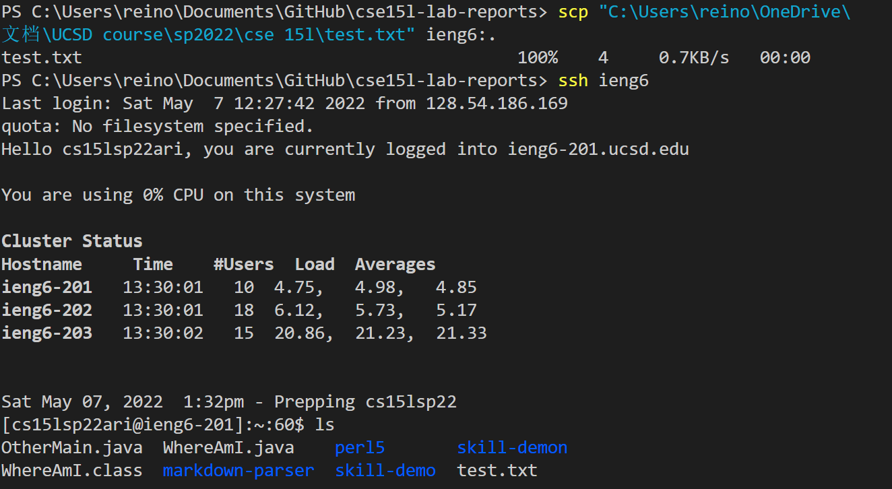


## Set up Github Access from ieng6

---

* ### Show where the public key you made is stored on Github and in your user account (screenshot)

    *This is the public key stored on Guihub*
    
    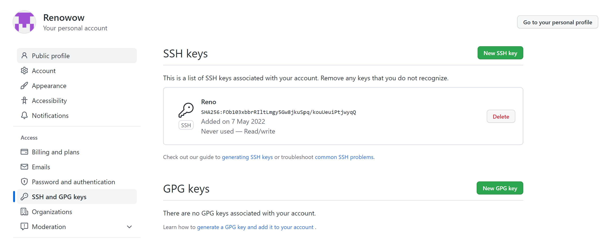
    
    *This is the public key stored on my user account*
    
    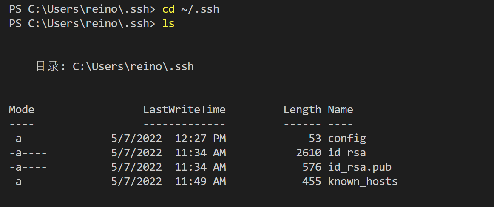
* ### Show where the public key you made is stored on Github and in your user account (screenshot)

    *This is the private key stored on my user account*
    
    
* ### Show running `git` commands to commit and push a change to Github while logged into your ieng6 account.

    *After we change some thing in file.*

    *we can use command `git commit -am (message)` to commit our cahnge*

    *Next, use `git push` to push our change into main repository in Github*

    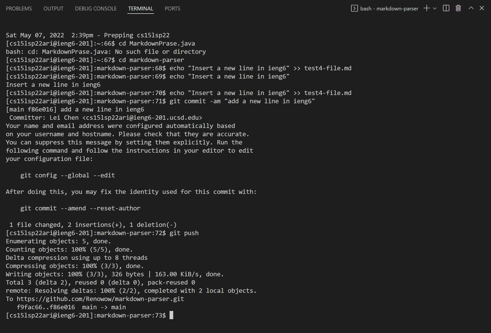
* ### Show a link for the resulting commit

    [resulting commit](https://github.com/Renowow/markdown-parser/commit/f86e01670db4eda8e505b6c17310c04400956e83)


## Copy Whole Directories with `scp -r`

---

* ### Show copying your whole markdown-parse directory to your ieng6 account

    *we use `scp -r . cs15lsp22ari@ieng6.ucsd.edu:~/markdown-parse` (own username) to copy whole markdown
    -parse directory*

    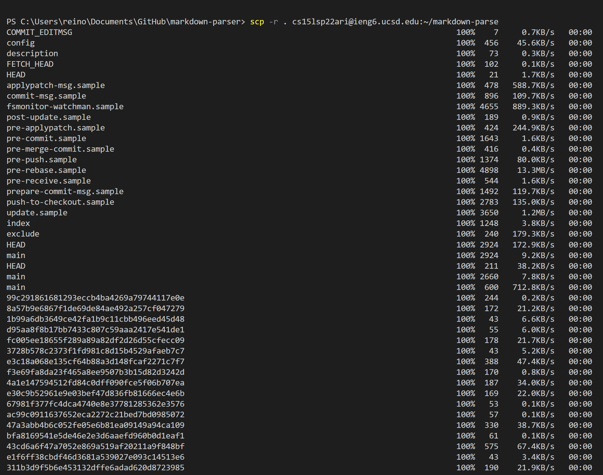

    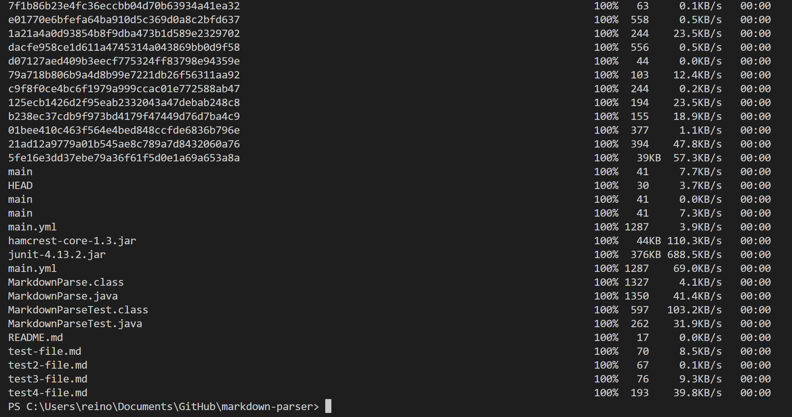
* ### Show logging into your ieng6 account after doing this and compiling and running the tests for your repository

    *Now we logging to our ieng6 account and use the commands below in `markdown.java`*
    `javac -cp .:lib/junit-4.13.2.jar:lib/hamcrest-core-1.3.jar MarkdownParseTest.java `
    `java -cp .:lib/junit-4.13.2.jar:lib/hamcrest-core-1.3.jar org.junit.runner.JUnitCore MarkdownParseTest`


    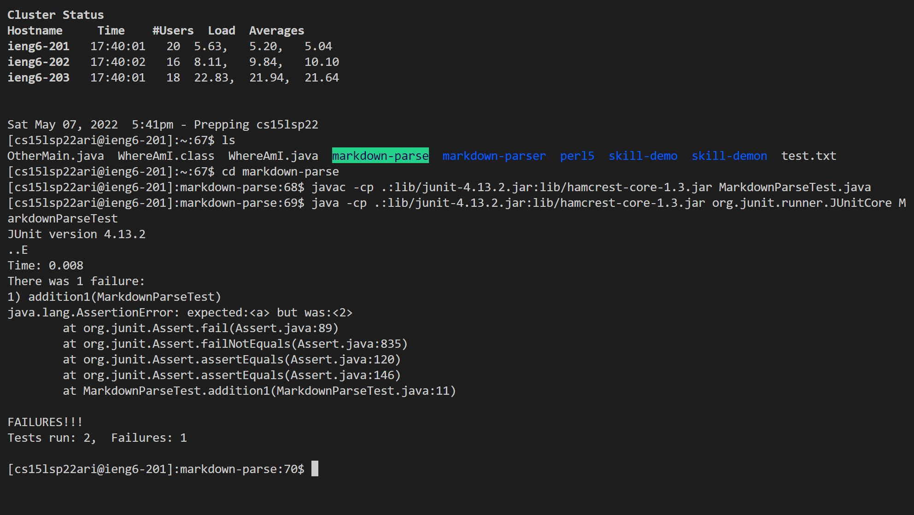

* ### Show (like in the last step ofthe firstlab) combining `scp`, `;`, and `ssh` to copy the whole directory and run the tests in one line

    *We run the command, and the output is what we expected*

    ```
    scp -r *.java *.md lib ieng6:markdown-parse; ssh ieng6 "cd markdown-parse; /software/CSE/oracle-java-17/jdk-17.0.1/bin/javac MarkdownParse.java; /software/CSE/oracle-java-17/jdk-17.0.1/bin/javac -cp .:lib/junit-4.13.2.jar:lib/hamcrest-core-1.3.jar MarkdownParseTest.java; /software/CSE/oracle-java-17/jdk-17.0.1/bin/java -cp .:lib/junit-4.13.2.jar:lib/hamcrest-core-1.3.jar org.junit.runner.JUnitCore MarkdownParseTest"
    ```

    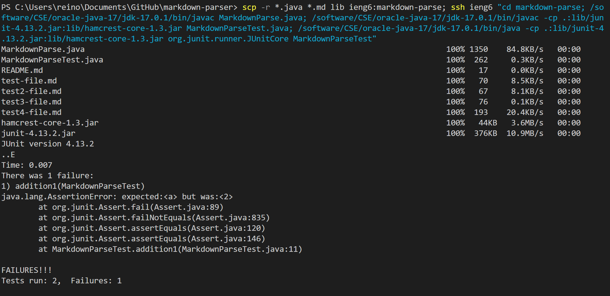
