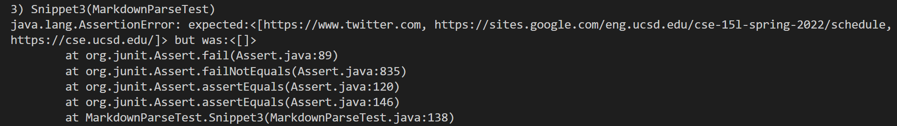

# Lab-Reprot-4-Week-8

>Hi, this is Reno, This week I am going to use three snippets to 
>test my own implementation of markdown-parse and others' implementation
>of markdown-parse

[My markdown-parse repository](https://github.com/Renowow/markdown-parser)
[Reviewed markdown-parse repository](https://github.com/canitry/markdown-parser)

## Snippet1
---

The first snippet's code is 

```
`[a link`](url.com)

[another link](`google.com)`

[`cod[e`](google.com)

[`code]`](ucsd.edu)
```

The output I can see when I put the code into [the CommonMark demo site](https://spec.commonmark.org/dingus/)


Based on the output, I can only see `another link`, `cod[e`, and `code]` in the link form,
so I guess the output will be "[`google.com, google.com, ucsd.edu]"

The code I use to test Snippet1

```
    @Test
    public void Snippet1() throws IOException {
        String contents= Files.readString(Path.of("./Snippet1.md"));
        List<String> expect = List.of("`google.com", "google.com"
        , "ucsd.edu");
        assertEquals( expect, MarkdownParse.getLinks(contents));
    }
```
### My implementation's output (failure)


### Reviewed implementation's output(failure)


### Is it possible to make a small change to fix My code?
I don't think so. Because we do not have any code related to backticks. I think if we want to fix the code to make it work, we need to create a hole structure to detect when backticks appears.


## Snippet2
---

The second snippet's code is 

```
[a [nested link](a.com)](b.com)

[a nested parenthesized url](a.com(()))

[some escaped \[ brackets \]](example.com)

```
The preview I can see in the vscode is 


Based on the blue link we can see on the pictrue I guess the output
is "[a.com, a.com(()), example.com]"

The code I use to test the snippet2 is 

```
    @Test
    public void Snippet2() throws IOException {
        String contents= Files.readString(Path.of("./Snippet2.md"));
        List<String> expect = List.of("a.com", "a.com(())"
        , "example.com");
        assertEquals( expect, MarkdownParse.getLinks(contents));
    }
```
### My implementation's output (failure)


### Reviewed implementation's output (failure)


### Is it possible to make a small change to fix My code?
Yes, I think the little error in the output related to our code of parentheses. We can add some code to make sure when we start a left bracket, untill we find the correspoding right bracket we will not output anything. 


## Snippet3
---

The third snippet's code is 

```
[this title text is really long and takes up more than 
one line

and has some line breaks](
    https://www.twitter.com
)

[this title text is really long and takes up more than 
one line](
https://sites.google.com/eng.ucsd.edu/cse-15l-spring-2022/schedule
)


[this link doesn't have a closing parenthesis](github.com

And there's still some more text after that.

[this link doesn't have a closing parenthesis for a while](https://cse.ucsd.edu/


)

And then there's more text
```

The preview I can see in the vscode is


In this case, I think the output will be "[https://www.twitter.com, 
https://sites.google.com/eng.ucsd.edu/cse-15l-spring-2022/schedule,
https://cse.ucsd.edu/]"

The code I use to test Snippet3
```
    @Test
    public void Snippet3() throws IOException {
        String contents= Files.readString(Path.of("./Snippet3.md"));
        List<String> expect = List.of("https://www.twitter.com", 
        "https://sites.google.com/eng.ucsd.edu/cse-15l-spring-2022/schedule"
        , "https://cse.ucsd.edu/");
        assertEquals( expect, MarkdownParse.getLinks(contents));
    }
```

### My implementation's output (failure)


### Reviewed implementation's output (failure)



### Is it possible to make a small change to fix My code?
No, I think I got a lot problems in this snippet. First, I need to take care of the space problem. Second, My code read the code like `github.com` which is not a complete link form. Too many codes need to add.