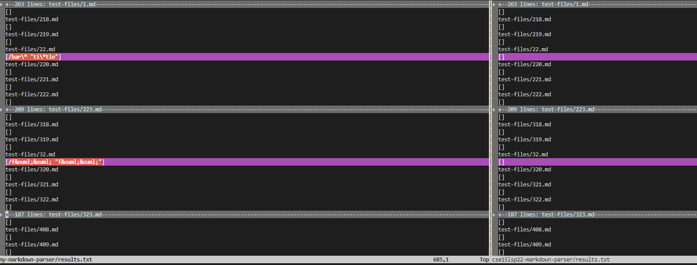
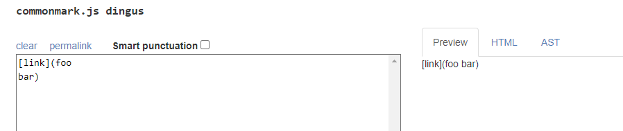
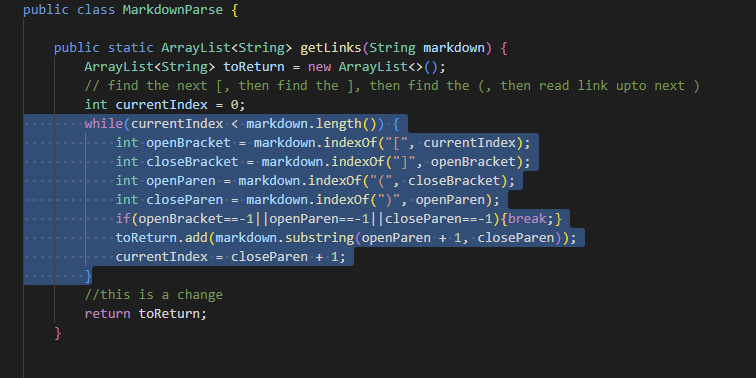
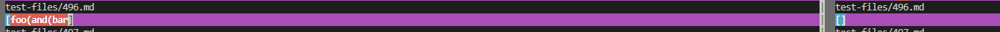

# Lab-Reprot-5-Week-10

>This week I am going to use `vimdiff` to test two differnt results
>in order to fix the problem.

## How you found the tests with different results?

First, I use `bash script.sh > results.txt` in both  my-markdown-parser and cse15lsp22-markdown-parser repositories
to get the results txt file.

Then I use the `vimdiff my-markdown-parser/results.txt cse15lsp22-markdown-parser/results.txt` to help me to find
out the different between two results.

>Result shows like below:

---

## Result1(test.files/489.md)

[Link to the test-file](https://raw.githubusercontent.com/nidhidhamnani/markdown-parser/main/test-files/489.md)

We use [the CommonMark demo site](https://spec.commonmark.org/dingus/) to check the expected:

based on the preview result, we are suppose to output `[]` , which means my repository got the wrong output,
but cse15lsp22-markdown-parser got right output.

>how to fix it?

The wrong result is because I did not detect the new line apear after the `(`. In order to fix this problem
I need to add a break point when we encounter a new line.

---

## Result2(test-files/496.md)

[Link to the test-file](https://raw.githubusercontent.com/nidhidhamnani/markdown-parser/main/test-files/496.md)

We use [the CommonMark demo site](https://spec.commonmark.org/dingus/) to check the expected:

based on the preview result, this file is not a link. We are suppose to output `[]` , which means my repository got the wrong output,
but cse15lsp22-markdown-parser got right output.

>how to fix it ?

I got the wrong result because I output the result when we start `(` and end at the first `)`. In fact, we should not print the result because we don't have a corresponding `)` for the first `(`. So, in order to fix this problem I need to add a counter or a help method to help me count the number of `(` and `)`, then we can pair then and avoid output too fast
